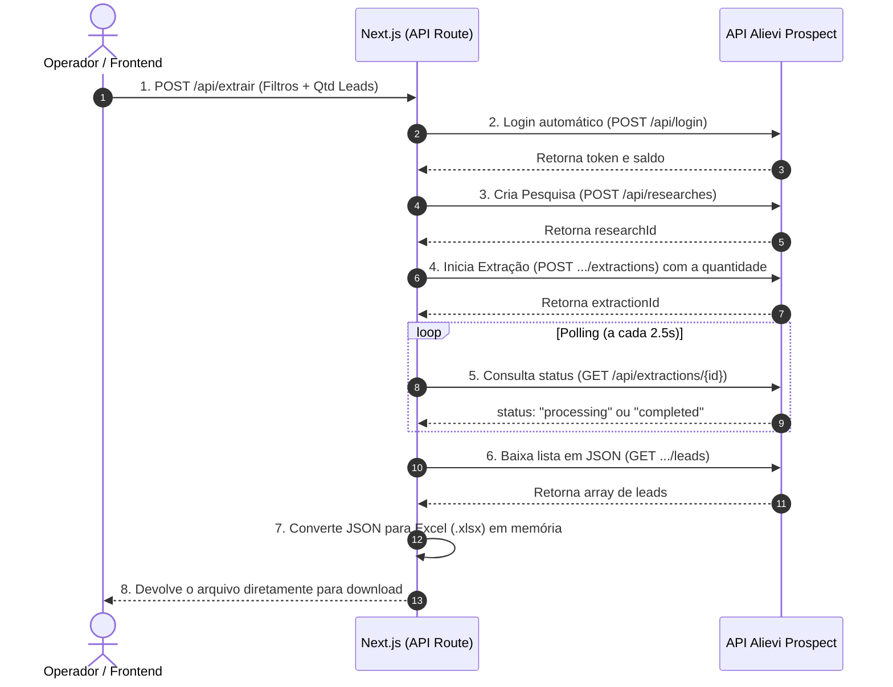

# 📋 Especificação Técnica & Plano de Implementação (Versão Ultra-Lean / Teste Direto)
## Extrator de Leads B2B via Alievi Prospect (Sem Banco, Sem Pagamento, Sem E-mail)

Este documento contém a especificação técnica para criar um **testador/extrator funcional direto**: apenas um **Frontend moderno** (com o formulário idêntico ao da Alievi) conectado ao **Backend (Next.js)** que consome a API da Alievi e entrega a planilha para download imediato.

> ⚡ **Escopo Desta Versão:**
> * ❌ **Sem Banco de Dados:** Totalmente stateless (não precisa de PostgreSQL, SQLite ou Prisma).
> * ❌ **Sem Gateway de Pagamento:** Sem Pix, sem Mercado Pago, sem taxas.
> * ❌ **Sem Serviço de E-mail:** Sem Resend, sem SMTP.
> * ✅ **100% Focado na Extração:** Formulário ➔ Consulta Alievi ➔ Download imediato do Excel (`.xlsx`) ou `.csv`.

---

## 1. Objetivo & Fluxo Simplificado

1. O operador abre a página local (`http://localhost:3000`).
2. A tela exibe o saldo de créditos atual da conta (ex: *"8.272 créditos disponíveis"*).
3. O operador preenche os campos (idênticos aos da Alievi):
   * **Nome da Pesquisa** (ex: "Farmácias Sergipe")
   * **Quantidade de Leads** (ex: 10, 20, 50 contatos)
   * **CNAE Primário** (ex: `4771701`)
   * **Estado (UF)** (ex: `SE`)
   * **Capital Social** (Inicial e Final, ex: `5000` a `500000`)
4. Clica no botão **"Extrair Leads"**.
5. O Next.js executa a rota interna, chama a Alievi, aguarda a finalização (polling) e **dispara o download automático do arquivo `.xlsx` / `.csv`**.

---

## 2. Diagrama do Fluxo (Stateless)



---

## 3. Endpoints da Alievi (Mapeamento Completo)

> **Base URL:** `https://app.alieviprospect.com/api`
> **Autenticação:** `Authorization: Bearer <TOKEN>`
> **Proteção:** Nenhuma (Nginx + Express direto, sem Cloudflare WAF/CAPTCHAs).

### 3.1. Login Automático
* **Endpoint:** `POST /api/login`
* **Payload:**
```json
{
  "username": "<ALIEVI_USERNAME>",
  "password": "<ALIEVI_PASSWORD>"
}
```
* **Retorno (200 OK):**
```json
{
  "credits": 8272,
  "token": "eyJhbGciOiJIUzI1NiIsInR5cCI6IkpXVCJ9..."
}
```

### 3.2. Criar Pesquisa
* **Endpoint:** `POST /api/researches`
* **Headers:** `Authorization: Bearer <TOKEN>`
* **Payload:**
```json
{
  "name": "Farmacias SE",
  "cnaes": ["4771701"],
  "cnaePrimario": "4771701",
  "state": "SE",
  "capitalRange": "5000-500000",
  "estimatedLeads": 1000
}
```
* **Retorno:** `{ "id": "7930d9cf-2602-412e-8aeb-737d34343f27" }` (Salva como `researchId`).

### 3.3. Disparar Extração
* **Endpoint:** `POST /api/researches/{researchId}/extractions`
* **Headers:** `Authorization: Bearer <TOKEN>`
* **Payload:**
```json
{
  "leadsCount": 20
}
```
* **Retorno:** `{ "id": "4a28018c-1c96-496a-bd20-ac0f7b5c5a8f" }` (Salva como `extractionId`).

### 3.4. Consultar Status (Loop)
* **Endpoint:** `GET /api/extractions/{extractionId}`
* **Headers:** `Authorization: Bearer <TOKEN>`
* **Retorno:** `{ "status": "completed", "leadsCount": 20 }` (Repetir a cada 2.5s até `completed`).

### 3.5. Baixar Contatos
* **Endpoint:** `GET /api/extractions/{extractionId}/leads`
* **Headers:** `Authorization: Bearer <TOKEN>`
* **Retorno:** Array com todos os leads contendo sócios, CNPJ, telefones, e-mails e endereço.

---

## 4. Código do Backend (Pronto para Uso no Next.js)

### 4.1. Serviço da Alievi (`lib/alievi.ts`)

```typescript
import axios, { AxiosInstance } from "axios";

export interface LeadItem {
  id: string;
  nome: string;
  nome_empresa: string;
  nome_fantasia: string;
  cnpj_empresa: string;
  phones: any[];
  email: any[];
  endereco_empresa: string;
}

export class AlieviService {
  private client: AxiosInstance;
  private token: string | null = null;

  constructor() {
    this.client = axios.create({
      baseURL: "https://app.alieviprospect.com/api",
      headers: {
        "User-Agent": "Mozilla/5.0 (Windows NT 10.0; Win64; x64) AppleWebKit/537.36",
        "Content-Type": "application/json",
      },
    });
  }

  async login(): Promise<{ token: string; credits: number }> {
    const { data } = await this.client.post("/login", {
      username: process.env.ALIEVI_USERNAME,
      password: process.env.ALIEVI_PASSWORD,
    });
    this.token = data.token;
    this.client.defaults.headers.common["Authorization"] = `Bearer ${this.token}`;
    return { token: data.token, credits: data.credits };
  }

  async extrair(params: {
    nome: string;
    cnae: string;
    estado: string;
    capitalMin: number;
    capitalMax: number;
    leadsCount: number;
  }): Promise<LeadItem[]> {
    if (!this.token) await this.login();

    // 1. Cria a pesquisa
    const resPesquisa = await this.client.post("/researches", {
      name: params.nome,
      cnaes: [params.cnae],
      cnaePrimario: params.cnae,
      state: params.estado,
      capitalRange: `${params.capitalMin}-${params.capitalMax}`,
      estimatedLeads: 1000,
    });
    const researchId = resPesquisa.data.id;

    // 2. Dispara a extração
    const resExtracao = await this.client.post(`/researches/${researchId}/extractions`, {
      leadsCount: Number(params.leadsCount),
    });
    const extractionId = resExtracao.data.id;

    // 3. Aguarda finalizar (polling a cada 2.5s)
    let concluido = false;
    let tentativas = 0;
    while (!concluido && tentativas < 60) {
      await new Promise((r) => setTimeout(r, 2500));
      const resStatus = await this.client.get(`/extractions/${extractionId}`);
      if (resStatus.data.status === "completed") {
        concluido = true;
      }
      tentativas++;
    }

    if (!concluido) throw new Error("A extração demorou muito para responder.");

    // 4. Obtém os leads em JSON
    const resLeads = await this.client.get(`/extractions/${extractionId}/leads`);
    return resLeads.data;
  }
}

export const alieviService = new AlieviService();
```

---

### 4.2. API Route de Extração (`app/api/extrair/route.ts`)

```typescript
import { NextResponse } from "next/server";
import { alieviService } from "@/lib/alievi";
import ExcelJS from "exceljs";

export async function POST(req: Request) {
  try {
    const body = await req.json();
    const leads = await alieviService.extrair(body);

    // Cria o arquivo Excel em memória
    const workbook = new ExcelJS.Workbook();
    const worksheet = workbook.addWorksheet("Leads");

    worksheet.columns = [
      { header: "Nome Sócio", key: "nome", width: 30 },
      { header: "Razão Social", key: "empresa", width: 35 },
      { header: "Nome Fantasia", key: "fantasia", width: 30 },
      { header: "CNPJ", key: "cnpj", width: 20 },
      { header: "Telefones", key: "telefones", width: 30 },
      { header: "E-mails", key: "emails", width: 35 },
      { header: "Endereço", key: "endereco", width: 45 },
    ];

    leads.forEach((l) => {
      const telefones = (l.phones || [])
        .map((p: any) => (typeof p === "string" ? JSON.parse(p).numero_formatado : p.numero_formatado))
        .filter(Boolean)
        .join(" | ");

      const emails = (l.email || [])
        .map((e: any) => (typeof e === "string" ? JSON.parse(e).endereco : e.endereco))
        .filter(Boolean)
        .join(" | ");

      worksheet.addRow({
        nome: l.nome || "",
        empresa: l.nome_empresa || "",
        fantasia: l.nome_fantasia || "",
        cnpj: l.cnpj_empresa || "",
        telefones: telefones || "",
        emails: emails || "",
        endereco: l.endereco_empresa || "",
      });
    });

    const buffer = await workbook.xlsx.writeBuffer();

    return new Response(buffer, {
      headers: {
        "Content-Type": "application/vnd.openxmlformats-officedocument.spreadsheetml.sheet",
        "Content-Disposition": `attachment; filename="leads_${body.estado}_${Date.now()}.xlsx"`,
      },
    });
  } catch (error: any) {
    return NextResponse.json({ error: error.message }, { status: 500 });
  }
}
```

---

## 5. Roteiro para o Desenvolvedor (Opus 5)

1. **Criar o Projeto Next.js:**
   * Rodar: `npx create-next-app@latest alievi-tester --typescript --tailwind --app --no-eslint`
   * Instalar dependências: `npm install axios exceljs lucide-react`
2. **Configurar o `.env.local`** apenas com as 2 variáveis de login.
3. **Criar a API Route:** Colocar o código da rota em `app/api/extrair/route.ts` e `lib/alievi.ts`.
4. **Criar o Frontend (`app/page.tsx`):**
   * Interface moderna com tema escuro (Dark Mode).
   * Badge no topo mostrando o saldo de créditos (chamando `POST /api/login` ao carregar a página).
   * Formulário com campos:
     - Nome da Pesquisa (input texto)
     - Quantidade de Leads (input numérico: default 10 ou 20)
     - CNAE Primário (input texto, ex: 4771701)
     - Estado UF (select com opções: SP, RJ, MG, SE, etc.)
     - Capital Social Mínimo e Máximo (inputs numéricos)
     - Botão grande com animação de loading: **"Extrair Leads e Baixar Planilha"**.
5. **Ao clicar:** Faz o `fetch('/api/extrair')`, converte a resposta para Blob e dispara o download automático no navegador (`window.URL.createObjectURL`).

---

## 6. Variáveis de Ambiente Únicas Necessárias (`.env.local`)

Apenas estas duas variáveis no arquivo `.env.local`:

```env
ALIEVI_USERNAME="<SEU_USUARIO_AQUI>"
ALIEVI_PASSWORD="<SUA_SENHA_AQUI>"
```
